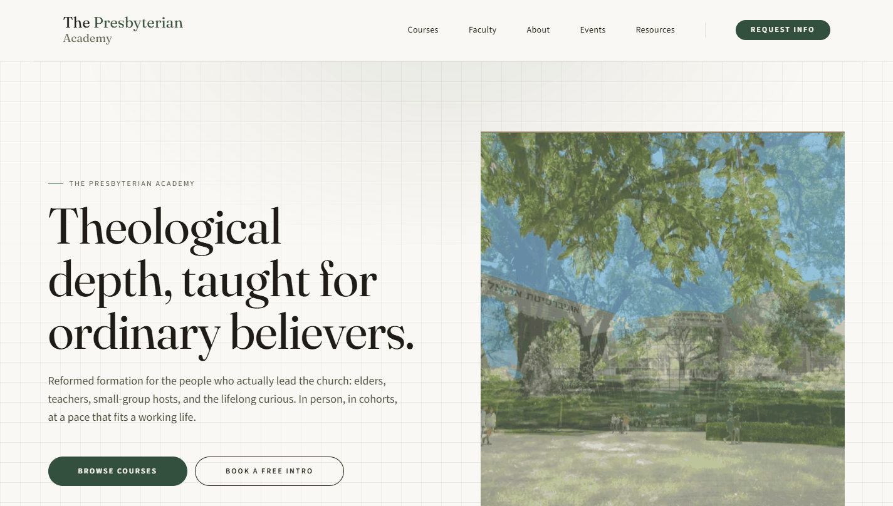
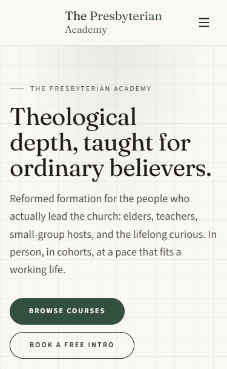

# The Presbyterian Academy

A statically built, CMS-driven school website: Astro, Sanity and Cloudflare Workers, with an embedded Studio, a gated CI pipeline and a tested design system.

[](https://github.com/NateJ45/presacademy/actions/workflows/ci.yml)
[](https://presbyterianacademy.org)


<p align="center">
  
  
</p>

Screenshots are the live home hero, taken above the fold. Site content is seed
text and stock photography until the real material arrives.

## What it is

The second site on the studio's Astro + Sanity + Cloudflare Workers stack,
live since 2026-09-04. Pages are prerendered, content lives in Sanity, and the
Studio is embedded in the site at `/studio`, so it ships and rebuilds with
every deploy. Draft edits preview through SSR routes with click-to-edit, while
visitors get static output.

## Engineering highlights

- **Embedded Sanity Studio** at `/studio`, with a Presentation-tool live
  preview over SSR `/preview/**` routes. There is no separately hosted Studio
  to drift out of date.
- **Pinned Sanity stack.** The Sanity packages are exact-pinned and move by
  hand as a set, never one at a time.
- **Layered quality gates.** `build` and `test` are required checks on a
  protected `main`. Playwright covers smoke, axe accessibility in both themes
  and reflow; visual regression runs on the style guide; unit tests check
  theme-token contrast.
- **Lighthouse gate** with metric-matched fallback fonts, so web-font swaps do
  not move layout or LCP.
- **Stale-types CI guard.** CI regenerates the Sanity types and fails if the
  committed ones are out of date.
- **Weekly encrypted Sanity backup** via a scheduled workflow, with a
  documented restore drill (`docs/RESTORE-DRILL.md`).
- **Design system** with light and dark themes, tokens in Tailwind 4 `@theme`
  blocks, and a block-based page builder.

**Stack:** Astro, Sanity, Cloudflare Workers, React islands, Tailwind 4,
TypeScript, Playwright, GitHub Actions.

Links: [live site](https://presbyterianacademy.org) and
[Nixon Creative Studio](https://nixoncreativestudio.com), who built it.
Security reports: see [SECURITY.md](SECURITY.md).

## Developing

```bash
# one package, one install (the Studio folded into the root on 2026-08-26)
npm install

# run it
npm run dev            # site on :4321 (Studio at /studio)
npm run preview        # the real Worker locally (wrangler; needed for /preview/**)

# ship it
npm run build          # OG cards + astro build (dist/client static, dist/server SSR)
npm run deploy         # build + wrangler deploy -c dist/server/wrangler.json
```

Content lives in Sanity (project `uz2sl3zp`), edited in the Studio embedded
at **`/studio`**. The public site is statically built, so a publish reaches
visitors after a rebuild (push to `main`, or the publish webhook), but
editors see unpublished drafts immediately in the Studio's Presentation tool,
which previews the SSR `/preview/**` routes with click-to-edit. Work lands on
short-lived branches and merges to `main` by PR (`main` is the only branch).

Quality gates (the family test standard, same as the WCP repo): `npm run check`
(astro check + eslint), `npm run format:check` (prettier), `npm run test:unit`
(unit + theme-token contrast), `npm test` (Playwright: smoke, axe in both
themes, reflow), `npm run test:visual` (style guide screenshots, CI baselines),
`npm run check:links` (after a build). See `docs/TESTING.md`.

## The files that orient you

| File              | What it is                                                           |
| ----------------- | -------------------------------------------------------------------- |
| `CLAUDE.md`       | The constitution: stack, conventions, landmines, content model       |
| `.claude/rules/`  | Path-scoped rules that load only when matching files are touched     |
| `docs/claude/`    | Moved-out CLAUDE.md reference: state, file ownership, topic index    |
| `design.md`       | The one-file design brief (palette, type, motion, signature moves)   |
| `OPERATIONS.md`   | The tactical runbook (deploy, audit content, patch data, gotchas)    |
| `docs/PENDING.md` | The live registry of open loops: queued work, waiting-on-human items |
| `docs/TESTING.md` | Which test suite covers what                                         |
| `docs/agent/`     | Deep-dives per area (theme, components, Sanity, deployment, ...)     |

AI-assisted workflow: project slash commands ship in `.claude/commands/`
(`/sanity-audit`, `/rebuild`, `/visual-verify`), and `design.md` plus
screenshots is the intended input for any visual work.

## Provenance

Reid Design build → ncs-astro-sanity-starter → Second Presbyterian Church of
Chicago build → ncs-church-starter → this repo (forked 2026-05, de-churched
2026-06, cut loose 2026-08). Photography in `src/assets/placeholders/` is
license-clean Pexels stock standing in until real Academy photography exists
(see `src/assets/placeholders/MANIFEST.md`).
